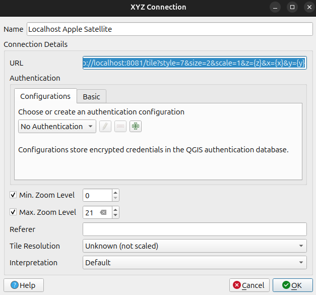
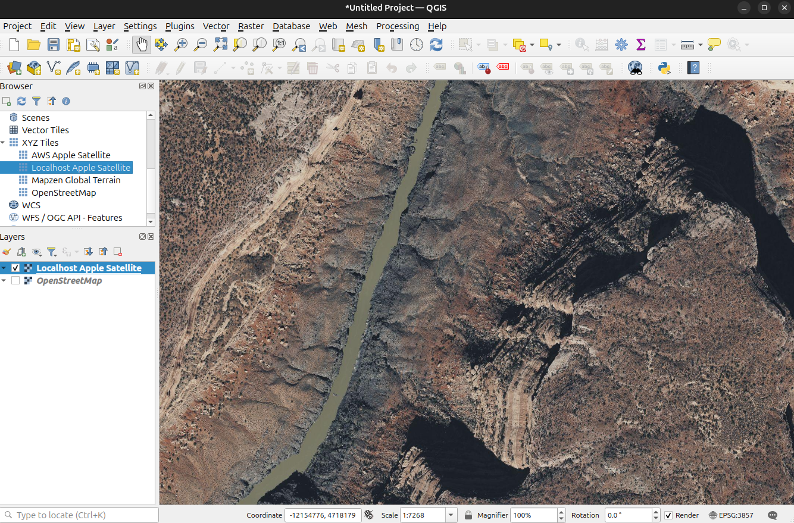

# apple-maps-proxy

A small Flask service that proxies Apple MapKit **satellite tile** requests.

It uses a headless Chrome/Chromium (via Selenium) to load Apple Maps and scrape a short‑lived MapKit `accessKey` from Chrome **performance logs**. That `accessKey` is then appended to upstream tile requests.

## What this does

- Starts a local HTTP server (Flask)
- Exposes a `/tile` endpoint compatible with typical XYZ tile clients
- For each incoming tile request:
  - Adds `accessKey=<current access key>`
  - Adds `v=<tile version>`
  - Proxies the request to Apple’s tile CDN (`sat-cdn.apple-mapkit.com`)

## Project layout

- `proxy.py` — The full implementation
- `requirements.txt` — Pinned runtime dependencies

## Requirements

- Python 3.12 (recommended; should work on 3.10+)
- Google Chrome or Chromium installed
- A compatible `chromedriver`

This project will try to auto-install a compatible chromedriver using `chromedriver-autoinstaller`. You can also provide a driver explicitly via the `CHROMEDRIVER` environment variable.

## Install

Create a virtual environment and install dependencies:

```bash
python3 -m venv .venv
source .venv/bin/activate
pip install -r requirements.txt
```

## Run

Start the proxy:

```bash
python3 proxy.py
```

By default it listens on `127.0.0.1:8081`.

## Use

QGIS: `http://localhost:8081/tile?style=7&size=2&scale=1&z={z}&x={x}&y={y}`



---



## Endpoints

### `GET /health`
Returns basic health status and key refresh timing.

Response includes:
- `key_age_seconds`
- `last_refreshed_at`
- `next_refresh_at`

### `GET /tile`
Proxies a tile request to Apple.

Example:

```text
http://127.0.0.1:8081/tile?style=7&size=2&scale=1&z=12&x=656&y=1583
```

The server appends these query parameters when calling upstream:
- `accessKey=<scraped>`
- `v=<apple tile version>`

## How `accessKey` is fetched

The function `_getAPIKey()`:

1. Starts headless Chrome/Chromium with performance logging enabled.
2. Loads `https://maps.apple.com/`.
3. Polls Chrome’s `performance` log entries.
4. Extracts an `accessKey=...` substring from logged request/response URLs.

Because Apple’s MapKit access keys expire, `proxy.py` will also refresh the key in the background periodically and retry once on `401/403` responses.

## Important note about `v=10281` (hardcoded)

In the current `proxy.py`, the `v` query parameter is **hardcoded** via:

- `create_app(*, v: str = "10281", ...)`
- `serve(..., v: str = "10281", ...)`
- `/tile` always sets `q["v"] = v`

This `v` value represents an Apple Maps tile/version identifier and **can change** with Apple Maps/MapKit releases.

If Apple changes this version, requests may start failing until `v` is updated. A more robust approach is to parse `v` dynamically from the same Apple Maps network traffic where the `accessKey` is discovered.

## Configuration (environment variables)

- `CHROMEDRIVER` — Absolute path to chromedriver (optional)
- `LOG_LEVEL` — Logging level (default: `INFO`)
- `ACCESS_KEY_REFRESH_INTERVAL_SECONDS` — Background refresh interval (default: `600`)
- `ACCESS_KEY_REFRESH_COOLDOWN_SECONDS` — Prevents redundant refreshes (default: `90`)

## Troubleshooting

### Chrome / chromedriver startup errors
- Ensure Chrome/Chromium is installed.
- Ensure chromedriver matches your browser version.
- Optionally set `CHROMEDRIVER=/path/to/chromedriver`.

### Upstream returns 401/403
This usually means the `accessKey` is expired or invalid. The proxy automatically refreshes and retries once.

### Running on servers/containers
`--no-sandbox` and `--disable-dev-shm-usage` are enabled for better compatibility in containerized environments.

